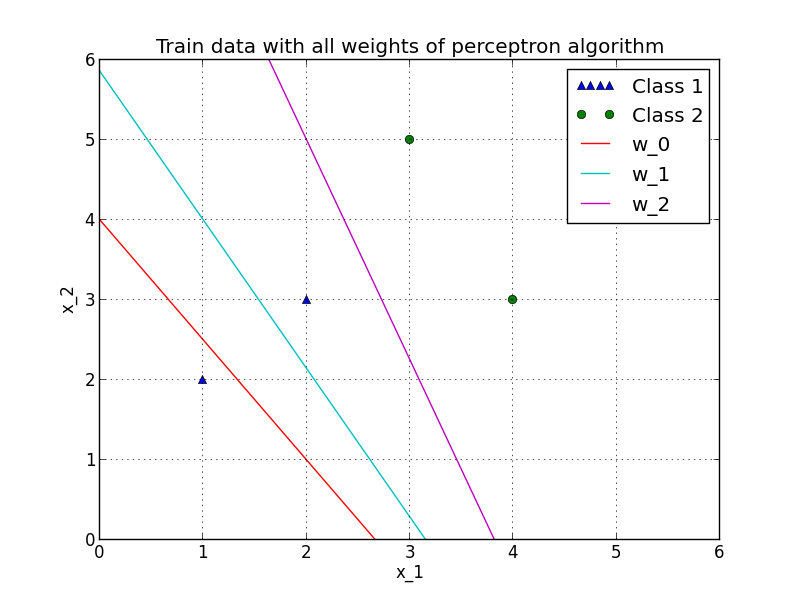

Implementation of perceptron algorithm and classification of feature vector
--------------------

The [perceptron](https://en.wikipedia.org/wiki/Perceptron) provides a linear classifier for a two dimensional feature vector.
Therefore it fits a given or random weight until it's error function is minimal, so most of the feature vectors are divided into to disjoint classes, or
the difference between two iterations is small enough.

The picture below shows feature vectors of two classes, a given initial weight (*w_0*) and calculated
weights over all iterations. So you might see the weight (*w_2*) is optimal, because it separates all feature vectors linear. You can find my implementation of the perceptron
algorithm in [src/perceptron.py](https://github.com/erohkohl/perceptron/blob/master/src/perceptron.py). Moreover I took advantage of the *testdriven* approach, thus all my test cases
are located under [test/perceptron.py](https://github.com/erohkohl/perceptron/blob/master/test/perceptron.py).

